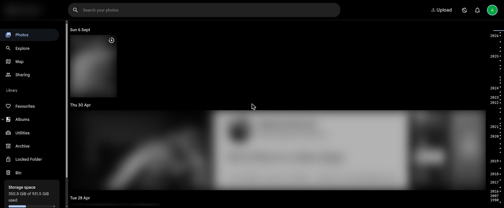
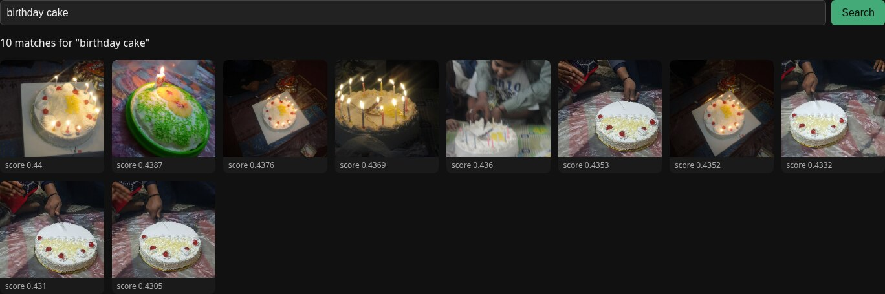
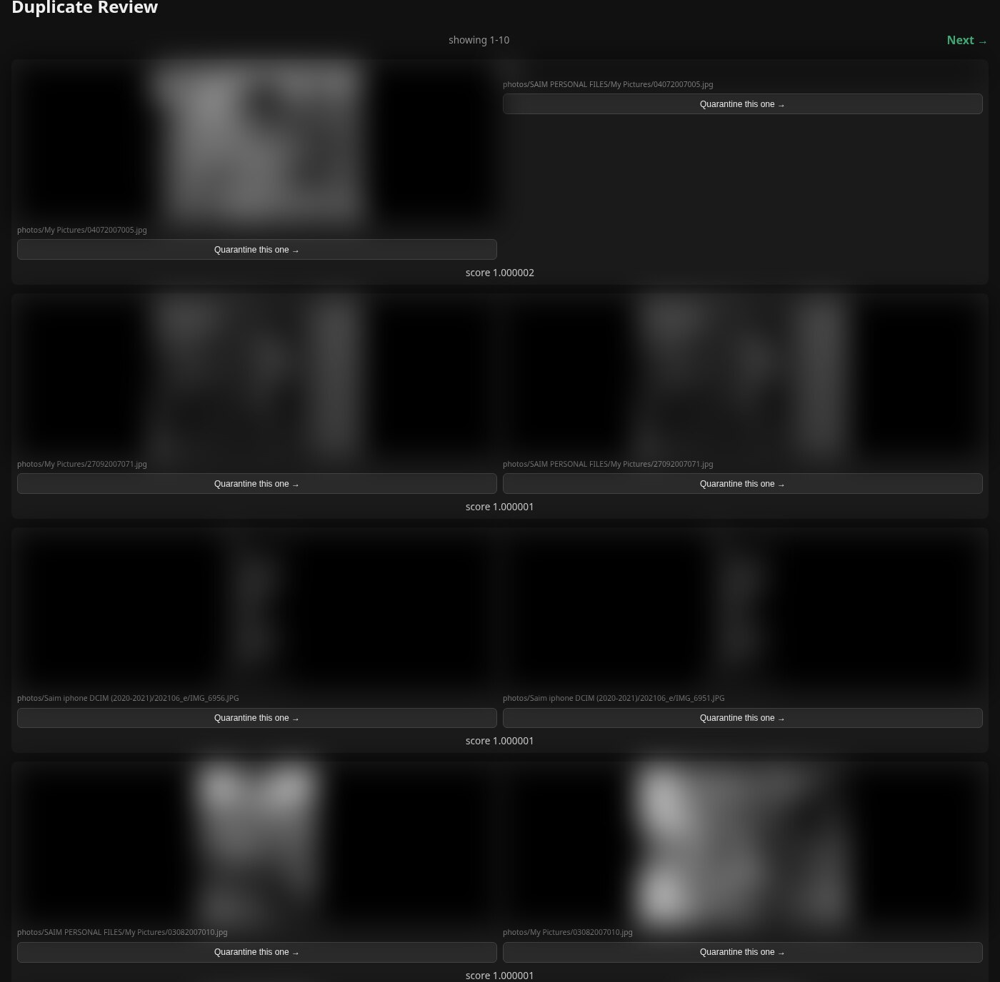
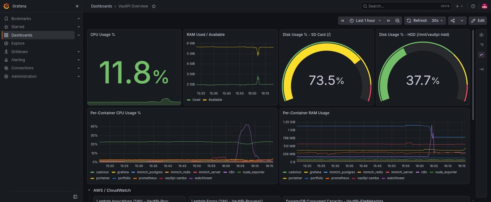

# VaultPi

A personal cloud + AI file intelligence platform built on a Raspberry Pi 4 and AWS — a real hybrid on-prem/cloud system, not another serverless CRUD app.

## Why this exists

The actual problem this solves:

- A Windows partition was eating ~1TB of laptop storage for two games that don't run on Nobara Linux — space that couldn't be reclaimed without giving up a "Google Drive equivalent" that didn't otherwise exist.
- There was no personal drive / NAS at all — files and photos piled up locally with no dedup, tagging, or backup story.
- An existing Raspberry Pi 4 (8GB RAM) was already running Portainer, n8n, and a personal website 24/7 — underused capacity that didn't need a second device to put to work.
- An external HDD had previously been written off as "too slow to be useful," when its slowness is actually irrelevant for an archival/backup role.

VaultPi turns that idle Pi + "useless" HDD into a personal NAS with AI-powered photo tagging, near-duplicate detection, and natural-language photo search — backed up to S3 instead of trusting a single SD card.

## Architecture

```
[Nobara laptop] --Samba (LAN only)--> [Pi 4, Docker host]
                                        ├─ Portainer (existing)
                                        ├─ n8n (existing)
                                        ├─ Website, via Cloudflare Tunnel (existing)
                                        └─ Samba --> External HDD (USB 3.0)
                                                 │
                                        scheduled rclone sync
                                                 │
                                                 v
                                        [S3: saim-vaultpi-files]
                                                 │
                                        S3 event --> [Lambda: process_upload]
                                                 │
                                    ┌────────────┼────────────────┐
                                    │                             │
                          [Rekognition: labels]     [Bedrock Titan: image embeddings]
                                    │                             │
                                    └─────────────┬───────────────┘
                                                   v
                                        [DynamoDB: VaultPi-FileMetadata]
                                                   │
                              (separate scripts: dedup, text-to-photo search)
                                                   │
                                        [S3 Lifecycle --> Glacier, planned]

Weekly: docker-compose configs + n8n volume --> S3 (pi-config-backup/)
```

Photos live locally-first on the HDD via Samba (fast, private, no recurring cost), then get pushed to S3 on a schedule. Landing in S3 triggers a Lambda that tags the image with Rekognition and generates a vector embedding with Bedrock's Titan Multimodal model, writing both into DynamoDB alongside the S3 key. From there, a couple of standalone scripts do the actual "smart" work: one walks the full embedding table to flag near-duplicate photos by cosine similarity, and another embeds a text query the same way and returns the closest-matching photos.

## Key architecture decisions

**Single Pi, not Pi + second Pi for redundancy.** The safer design would split storage onto one Pi and backup/monitoring onto a second. Everything was deliberately consolidated onto the one existing Pi instead, to force real hands-on lessons in resource contention and service isolation across multiple Docker containers on constrained hardware, rather than sidestepping that problem with more hardware. The acknowledged cost is a single point of failure — mitigated (not eliminated) by a weekly backup of Docker configs and n8n's data to S3, so a Pi failure is recoverable rather than catastrophic.

**Bedrock Titan embeddings instead of self-hosted CLIP.** The original plan considered Rekognition for tagging as the fast first win, then self-hosted CLIP (`clip-vit-base-patch32`) as a stretch goal for real embeddings — which would have meant packaging a model into a Lambda container image and owning its runtime. Amazon Bedrock's Titan Multimodal Embeddings model was used instead: it returns a 1024-dim embedding for either an image or a text query through a single managed API call, so both tagging and embeddings run as plain `InvokeModel` calls with nothing to host or version. Keeps the "AI runs in the cloud, not on the Pi" principle intact without taking on model-hosting complexity that a personal-scale project doesn't need.

**File shares never share the public tunnel.** The Pi is already internet-facing via Cloudflare Tunnel for the personal website. Samba was kept strictly LAN-only rather than routed through that same tunnel — file-sharing protocols aren't designed to be internet-facing, and reusing the website's public path for it would turn a personal-NAS project into a real security incident. Remote file access, if ever needed, would get its own separate, access-controlled route.

**Hybrid storage tiering.** Files stay local-first on the HDD (fast enough for personal use, private by default, zero recurring cost) rather than uploading everything to the cloud immediately. A sync job pushes copies to S3, which both triggers the AI pipeline and doubles as offsite backup, with a planned Lifecycle rule to age untouched files into Glacier. This mirrors a real enterprise hybrid-cloud pattern — on-prem primary, cloud for processing and disaster recovery — instead of "everything local, no backup" or "everything in the cloud, pay for it all."

## Current status

| Milestone | Status |
|---|---|
| 0 — Foundation & safety rails (IAM, budget, S3 bucket) | Done |
| 1 — Local NAS layer (Samba + HDD, LAN-only) | Done |
| 2 — Cloud sync pipeline (rclone, scheduled) | Done |
| 3 — AI processing layer (Lambda: Rekognition + Bedrock) | Done |
| 4 — Metadata & smart search (DynamoDB, dedup, text search) | Done |
| 5 — Cold storage & backup/DR | Partial — weekly Pi config backup done, DynamoDB PITR + deletion protection enabled; S3 → Glacier lifecycle rule not yet configured |
| 6 — Dashboard & polish (Prometheus + Grafana, disk alerts via Discord) | Done |
| 7 — Terraform (infra as code) | Done |
| 8 — Ansible (config management) | Done |
| 9 — Immich (photo library UI + mobile upload) | Done |
| 10 — Tailscale (secure remote access) | Done |
| 11 — n8n Photo Search & Duplicate Review UI (+ quarantine) | Done |

## How to use VaultPi

Everything below assumes you're already on the same network as the Pi — either physically (same LAN/Wi-Fi) or via Tailscale. This is functional webhook-based tooling built for one person's use, not a polished consumer app — see the honest caveats at the end before expecting App Store-level polish.

### Connecting

- **On the LAN:** the Pi answers to `anakafeel-pi.local` (mDNS, via avahi — survives DHCP renewals and router resets, so it's the address used everywhere below).
- **Remotely, via Tailscale:** install the Tailscale app (desktop or mobile) and log in with the account that's on this tailnet. Once connected, the Pi is reachable at its tailnet address (`100.68.237.12`) exactly as if you were on the LAN — same ports, same URLs, just swap the hostname.

### Immich — browsing the photo library / mobile upload

- **App:** the official Immich app (iOS/Android), or just a browser.
- **Server URL:** `http://100.68.237.12:2283` (Tailscale) or `http://anakafeel-pi.local:2283` (LAN).
- **What it's for:** browsing the existing ~14,800-photo library in place (it reads the HDD's folders directly as read-only external libraries, nothing is copied), or uploading new phone photos into VaultPi's own managed storage. Immich's built-in AI features (smart search, facial recognition) are deliberately switched off — VaultPi already has its own Bedrock-based tagging/embedding/dedup pipeline, so Immich here is the human-friendly viewer/uploader layer, not the "smart" layer.



### Photo Search — natural-language photo search

- **URL:** `http://anakafeel-pi.local:5678/webhook/photo-search` (or the Tailscale host on port 5678).
- **How it works:** type a plain-English description of what you're looking for ("birthday cake", "dog at the beach") and hit Search. Your query gets embedded with the same Bedrock Titan model used for every photo, compared against the cached embedding table, and the closest matches come back as thumbnails with similarity scores.
- **Speed:** the embedding table is cached on disk and refreshed every 6 hours. A query that lands on a stale cache takes ~55-60s (it has to re-scan all ~14,800 DynamoDB items first); anything after that in the same window comes back in a few seconds.
- **Tip:** bookmark it to your phone's home screen (Share → Add to Home Screen on iOS, or the browser menu's equivalent on Android) — it opens full-screen without browser chrome, so it behaves like a lightweight standalone app.



### Duplicate Review — near-duplicate cleanup

- **URL:** `http://anakafeel-pi.local:5678/webhook/duplicate-review` (or the Tailscale host on port 5678).
- **How pagination works:** loads 10 near-duplicate pairs at a time (found via cosine similarity across every stored embedding), with `← Previous` / `Next →` links that just adjust an `?offset=` query param.
- **How quarantine works:** each photo has a "Quarantine this one" button that moves that specific file into `_quarantine/` on the HDD and deletes its S3 copy. As of the security fix requiring a shared-secret token on that webhook, the button already knows the token and attaches it automatically — there's nothing to configure or remember, just click the side you want to remove.



*(The photos in that screenshot are blurred on purpose — these are real near-duplicate pairs from a personal photo library, most of which show identifiable family photos. The UI itself, the scores, and the buttons are all real and unedited.)*

### Grafana — VaultPi Overview dashboard

- **URL:** `http://anakafeel-pi.local:3001` (or the Tailscale host on port 3001). Requires logging in with the Grafana account set up during provisioning.
- Shows CPU/RAM/disk usage for the Pi as a whole and per-container, plus AWS-side metrics pulled from CloudWatch (Lambda invocations/errors, DynamoDB consumed capacity, S3 bucket size trend). Disk-usage alerts fire to Discord automatically before a mount fills up, rather than being discovered after the fact.



### Honest expectations

This is hand-rolled webhook tooling, not a shipped product: Photo Search and Duplicate Review are unauthenticated plain-HTML pages whose actual security boundary is "you have to be on the LAN or the tailnet to reach them" — there's no login screen because the network is the login screen. There's no offline support, no mobile-native anything (beyond home-screen bookmarking), and if an n8n workflow fails partway through (a restart mid-scan, a bad path), you'll get a blank or broken page rather than a friendly error message. What it does do well: search results are genuinely useful, dedup finds real duplicates instead of false positives, and quarantine plus the existing S3 backup means a wrong click is recoverable, not catastrophic. Judge it as a working personal tool, not a consumer app.

## Lessons learned

**Near-duplicate detection surfaced structural problems, not just accidental re-saves.** Running cosine similarity across ~14,800 stored embeddings turned up ~11,400 candidate duplicate pairs — but the biggest clusters weren't isolated duplicate photos, they were entire folders that had been copied wholesale: a `My Pictures` tree mirrored inside `SAIM PERSONAL FILES`, three separate iPhone DCIM date-folders with heavy cross-overlap, and a Note 8 `DCIM` vs `DCIM (1)` copy-conflict folder. Embedding-based dedup is as much a tool for finding organizational debt as it is for finding literal duplicate files.

**Raw object counts are not the same as the real target count.** The initial backfill assumption was ~73,700 objects under the photos prefix. The actual eligible image count (JPEG/PNG/HEIC only) turned out to be roughly 14,800 — about a fifth of that — once sidecar files (`.aae`), raw camera formats (`.dng`, `.cr2`, `.nef`), and other non-target files were excluded. Worth computing the real filtered count up front next time, rather than treating a raw listing count as the target.

**Video formats were excluded from the pipeline from the start, on purpose.** The sync script explicitly skips `.mov`/`.mp4`/`.avi`/`.m4v`, since Rekognition's labels and Bedrock's image embeddings are both photo-only, and video files are large enough that syncing and (attempting to) process them would meaningfully increase both storage and AI-invocation cost for no benefit to the dedup/search use case.

## Repo structure

- `pi-configs/` — docker-compose files for the services running on the Pi (n8n, watchtower, samba)
- `scripts/` — sync, AI backfill, dedup, search, and backup/maintenance scripts that run on the Pi
- `config/` — non-secret config used by the scripts (e.g. the list of photo source folders)
- `lambda/process_upload/` — the S3-triggered Lambda that tags and embeds each new photo
- `terraform/` — infra as code for the AWS side (IAM, S3, DynamoDB, Lambda)
- `ansible/` — config management for the Pi (Docker, HDD mount, Samba, n8n, Immich, Tailscale, monitoring, cron jobs)
- `docs/screenshots/` — real screenshots of the running system, referenced from the usage section above
